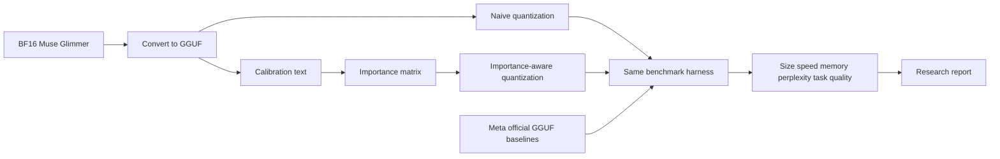

# Quantized Muse Glimmer

An educational, reproducible research lab for post-training quantization and
benchmarking of Meta's Muse Glimmer 30B.

> This project does not make the model literally quantize itself. An agent can
> orchestrate deterministic conversion, calibration, quantization, inference,
> and comparison tools; the resulting weights are a smaller copy of the
> original model.

## Why this project is staged

This workstation has 8 GiB unified memory. Muse Glimmer's BF16 checkpoint is
roughly 59.6 GB, so the full conversion and custom quantization must run on a
larger GPU/system-memory machine. The repository therefore contains safe
dry-run tooling that can be prepared locally, while the actual 30B job runs on
approved remote or borrowed hardware.

Meta's official GGUF release already includes two text builds, a perception
projector, and a DFlash drafter. We will benchmark those as external baselines
and produce independent custom quants from the BF16 source. We will not claim
byte-identical reproduction of Meta's files.



## Research questions

- What is the size/quality/speed tradeoff among `Q4_K_M`, `Q5_K_M`, and
  `Q6_K`?
- Does a representative importance matrix improve the lower-bit variants?
- How different are custom quantizations from Meta's published 17 GB and
  dynamic builds?
- What changes when the separately quantized vision projector and DFlash
  drafter are added?

## Learning path

1. Precision, BF16/FP16, integer quantization, bits-per-weight.
2. Post-training quantization versus quantization-aware training.
3. GGUF containers, tensor blocks, scales, zero-points, K-quants, and I-quants.
4. Calibration data and activation-based importance matrices.
5. Model weights versus runtime components: `mmproj` and DFlash.
6. Fair benchmarking: fixed inputs, decoding settings, hardware, repetitions,
   and provenance.

Every implementation lesson ends with an 80/20 summary:

### The core 20%

- Start from BF16/FP16 and keep the source immutable.
- Compare size, speed, memory, perplexity, and task behavior together.
- Use representative calibration data for importance-aware quantization.
- Pin the runtime and record every experiment input.
- Treat official quants, custom quants, `mmproj`, and DFlash as separate parts.

### What to ignore

- Re-quantizing an already-quantized file as the main experiment.
- Treating model-file size alone as evidence of quality.
- Chasing every quantization format before establishing a reliable baseline.

### The first action

Create the experiment manifest before downloading or converting model weights.

## Quick start

```bash
python3 -m venv .venv
source .venv/bin/activate
python -m pip install -e '.[dev]'

# Inspect commands without downloading weights or running a model.
python -m scripts.prepare --dry-run
python -m scripts.convert --dry-run
python -m scripts.imatrix --dry-run
python -m scripts.quantize --dry-run
python -m scripts.benchmark --dry-run
```

## First paid GPU milestone

The first remote run is deliberately staged. It creates and preserves one
custom `Q4_K_M` before any optional recipe, then compares it with BF16 and
Meta's official text GGUF baselines. It does not download `mmproj` or DFlash,
create an importance matrix, or create Q5/Q6 variants.

```bash
python -m scripts.prepare --execute --text-only
python -m scripts.convert --execute
python -m scripts.quantize --execute --recipes q4_k_m --threads "$(nproc)"
python -m scripts.preserve --execute \
  --source artifacts/quantized/Muse-Glimmer-30B-q4_k_m.gguf \
  --destination /shared/results/models/Muse-Glimmer-30B-custom-Q4_K_M.gguf
python -m scripts.benchmark --execute --mode all
python -m scripts.report --input results/benchmarks.jsonl
```

Run the complete remote procedure from
[runbooks/vessl-stage1.md](runbooks/vessl-stage1.md). The runbook includes the
5.5-hour/10-credit ceiling, billing snapshots, preflight checks, safe source
cleanup, and workspace termination instructions.

## GPU execution requirements

Use a system with at least 64 GiB system RAM and approximately 150 GiB of free
disk for the source checkpoint, converted intermediate, and outputs. Build or
download a `llama.cpp` version supporting Muse Glimmer, at least build `b10353`.

The later full research pipeline is:

```bash
python -m scripts.prepare --execute --artifact-dir /data/muse-glimmer
python -m scripts.convert --execute --model-dir /data/muse-glimmer/source/Muse-Glimmer-30B
python -m scripts.imatrix --execute --model /data/muse-glimmer/converted/Muse-Glimmer-30B-BF16.gguf
python -m scripts.quantize --execute \
  --input /data/muse-glimmer/converted/Muse-Glimmer-30B-BF16.gguf \
  --imatrix /data/muse-glimmer/converted/imatrix.gguf
python -m scripts.benchmark --execute --artifact-dir /data/muse-glimmer
python -m scripts.report --input results/benchmarks.jsonl
```

The scripts default to dry-run mode. `--execute` is explicit because model
downloads, conversion, and quantization are large and time-consuming.

## Repository contract

Model weights are excluded from Git. Public results should include the model
revision, runtime revision, commands, calibration hash, hardware, file hashes,
and benchmark records. This makes the study reproducible without redistributing
multi-gigabyte artifacts.

See [report/README.md](report/README.md) for the report questions and
[configs/experiment.yaml](configs/experiment.yaml) for the immutable experiment
definition.

## Sources

- [Muse Glimmer model card](https://huggingface.co/meta-models/Muse-Glimmer-30B)
- [Official Muse Glimmer GGUF release](https://huggingface.co/meta-models/Muse-Glimmer-30B-GGUF)
- [llama.cpp quantization guide](https://github.com/ggml-org/llama.cpp/blob/master/tools/quantize/README.md)
- [llama.cpp importance-matrix guide](https://github.com/ggml-org/llama.cpp/blob/master/tools/imatrix/README.md)
- [Hugging Face quantization overview](https://huggingface.co/docs/transformers/main/en/quantization/overview)
- [Originating X post](https://x.com/ben_burtenshaw/status/2086758382241763824)
